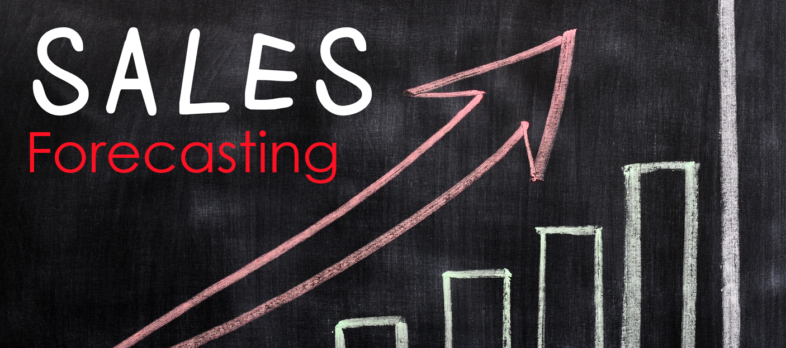

# Walmart_Sales_Forecasting

##### Walmart is a multinational retail corporation that operates a chain of hypermarkets, discount department stores, and grocery stores. It was founded by Sam Walton in 1962 and is headquartered in Bentonville, Arkansas, United States. Walmart is one of the world's largest retailers and is known for its "Everyday Low Prices" philosophy. The company operates more than 11,000 stores in 27 countries, including the United States, Canada, Mexico, the United Kingdom, China, Brazil, and India.In addition to its brick-and-mortar stores, Walmart also operates an e-commerce platform, Walmart.com, which offers a wide range of products and services, including groceries, electronics, clothing, and home goods.Walmart employs over 2.3 million people worldwide, making it one of the largest private employers in the world. The company has faced criticism over its labor practices and its impact on small businesses, but it remains a major force in the retail industry.
###### Walmart uses a variety of methods to forecast sales, including historical sales data, trend analysis, and predictive analytics. Here are some of the key factors that Walmart considers when forecasting sales:

### Historical sales data: 
###### Walmart analyzes its sales data from previous years to identify patterns and trends. This helps the company to forecast future sales based on past performance.

### Seasonal trends:
##### Walmart takes into account seasonal trends, such as holiday shopping and back-to-school season, when forecasting sales.

### Market trends:
##### Walmart tracks industry trends and consumer behavior to understand how external factors, such as economic conditions and changing consumer preferences, may impact sales.

### Demographics: 
##### Walmart considers demographic data, such as age, income, and location, to identify trends and forecast sales.

### Predictive analytics:
###### Walmart uses advanced analytics tools to analyze data and make predictions about future sales. These tools incorporate data from a variety of sources, including social media, weather data, and economic indicators.

